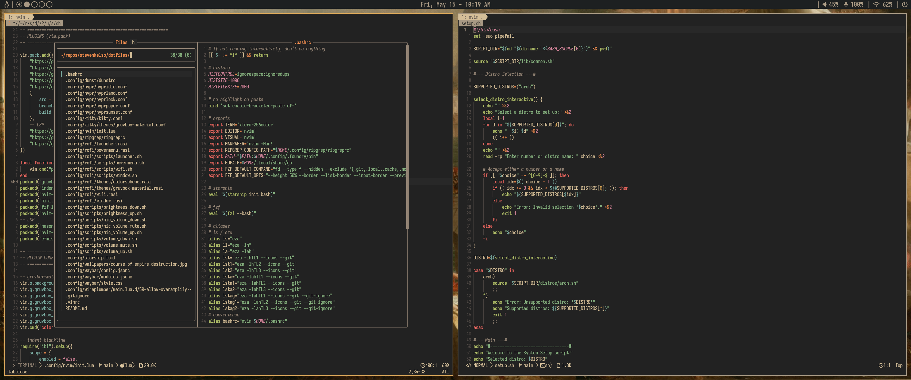

# dotfiles

My personal Linux configuration files.



## Stack

| Tool | Purpose |
|------|---------|
| [Niri](https://niri-wm.github.io/niri/) | Wayland compositor |
| [Ironbar](https://github.com/jakestanger/ironbar) | Status bar |
| [Kitty](https://sw.kovidgoyal.net/kitty/) | Terminal emulator |
| [Rofi](https://github.com/davatorium/rofi) | App launcher / menus |
| [Mako](https://github.com/emersion/mako) | Notification daemon |
| [Neovim](https://neovim.io/) | Text editor |
| [Starship](https://starship.rs/) | Shell prompt |

## Installation

**Prerequisites:** `git` and `stow` must be installed.

```bash
# Clone the repo to your home directory
git clone https://github.com/stevenkelso/dotfiles.git
cd ~/dotfiles

# Stow all configs
stow -t "$HOME" .
```

> [!WARNING]
> Stow will fail if conflicting files already exist. Back up or remove any existing configs first (e.g. `~/.bashrc`, `~/.config/hypr/`).

To remove symlinks:

```bash
stow -D -t "$HOME" .
```

## Wallpaper

The wallpaper is *The Course of Empire: Destruction* (1836) by Thomas Cole, modified for ultrawide monitors.
